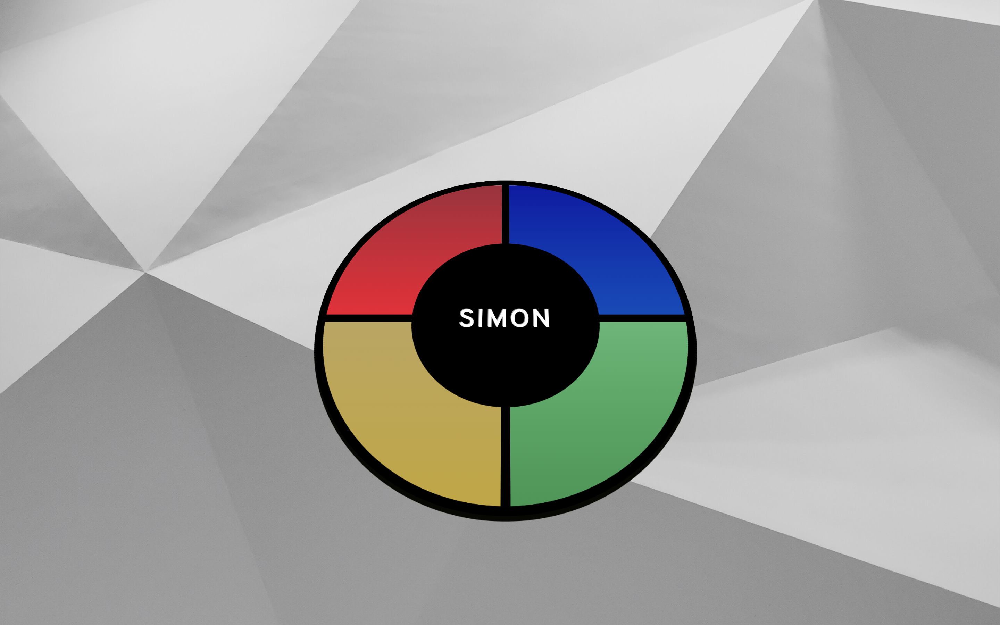

# simon-game

The purpose of this repository was to recreate Hasbro's popluar memory game, Simon. 

## Website

[Simon!](https://llucas314.github.io/simon-game/)

## Screenshots

## Built With

* Javascript
* HTML
* CSS

## Challenges

Getting the lights to flash correctly was tricky, but with the use of transition event listeners, I was able to accomplish the desired effect. Trying to make everything 3D was also a challenge, but with a little research I was able to get the images to rotate correctly. 

## How to Run

1. Fork and clone this repository.
2. Open index.html in your browser.
3. The lights can be either clicked on or controlled by the keys.

|Key|Light|
|:---:|:---:|
|<kbd>w</kbd>| `Red Light`|
|<kbd>e</kbd>| `Blue Light`|
|<kbd>d</kbd>| `Green Light`|
|<kbd>s</kbd>| `Yellow Light`|

  
## Contributing

If you have any comments or suggestions please feel free to contact me through github.  

## Future Additions

I would like to improve on the sound effects, and add a "top scores" section.

## Authors

* Lorenzo Lucas 
