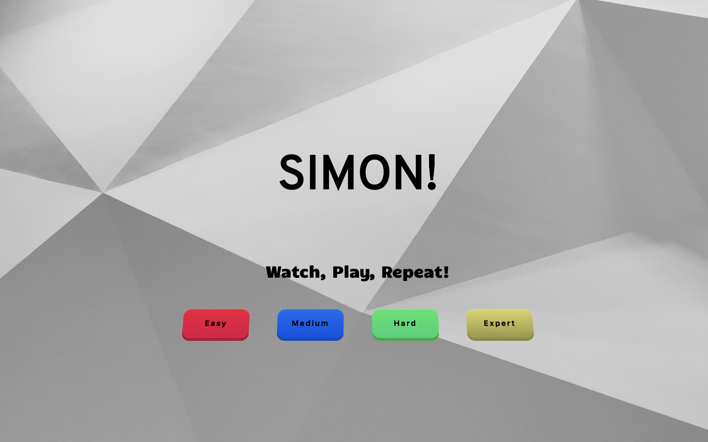
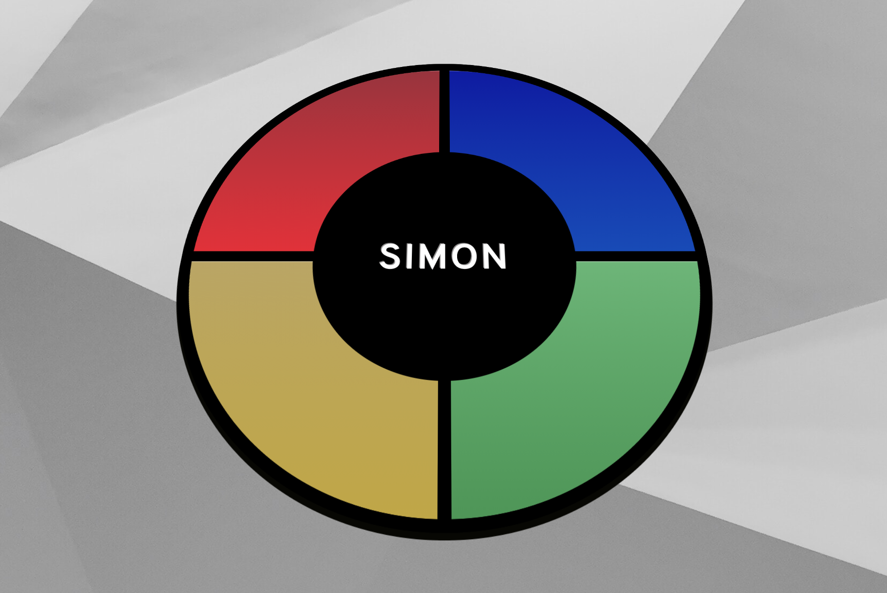

# simon-game

The purpose of this repository was to recreate Hasbro's popluar memory game, Simon. 

## Screenshots

## Built With

* Javascript
* HTML
* CSS

## How to Run

1. Fork and clone this repository.
2. Open index.html in your browser.

  
## Contributing

If you have any comments or suggestions please feel free to contact me through github.  

## Future Additions

I would like to improve on the sound effects and add a "top scores" section.

## Authors

* Lorenzo Lucas 
